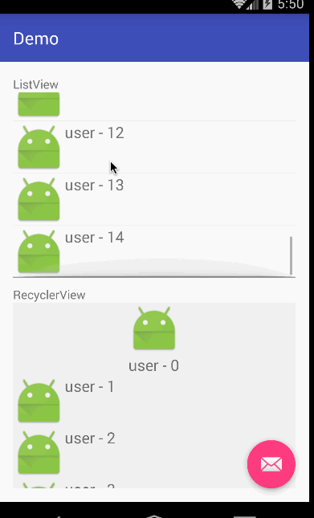

# Android Common Adapter 

>该库用于简化AbsListView类型与RecyclerView的Adapter构建，在ListViewAdapter和RecyclerAdapter封装了固定的业务逻辑，使得用户只需要实现变化的部分即可，简化代码，避免重复的模板代码。


例如，我们要实现一个适用于AbsListView的Adapter时，通常代码如下: 

```
/**
 * Created by mrsimple on 28/9/15.
 */
public class FeedAdapter extends BaseAdapter {
    /**
     * 数据集
     */
    protected List<String> mDataSet = new ArrayList<String>();

    public FeedAdapter(List<String> datas) {
        mDataSet = datas;
    }

    @Override
    public String getItem(int position) {
        return mDataSet.get(position);
    }

    @Override
    public int getCount() {
        return mDataSet.size();
    }

    @Override
    public long getItemId(int position) {
        return position;
    }

    @Override
    public View getView(int position, View convertView, ViewGroup parent) {
        FeedViewHolder viewHolder = null;
        if (convertView == null) {
            convertView = LayoutInflater.from(parent.getContext()).inflate(R.layout.list_item_type_1, parent, false);
            viewHolder = new FeedViewHolder(convertView);
            convertView.setTag(viewHolder);
        } else {
            viewHolder = (FeedViewHolder) convertView.getTag();
        }
        // 设置数据
        viewHolder.textView.setText( getItem(position));
        return convertView;
    }

    /**
     * Feed ViewHolder
     */
    public static class FeedViewHolder {
        public ImageView imageView;
        public TextView textView;

        public FeedViewHolder(View itemView) {
            imageView = (ImageView) itemView.findViewById(R.id.imageview);
            textView = (TextView) itemView.findViewById(R.id.textview);
        }
    }
}
```
当Adapter的数量有几个时，就会反复编写getCount、getItem、getView等函数，但是它们的实现都是非常类似的，反复编写这类代码会使得代码重复率很高。Common Adapter对这些逻辑进行了二次封装，使得用户可以更方便的构建Adapter类，示例如下: 


## 用于AbsListView的Adapter

```
/**
 * String表示这个Adapter的单个Item的数据类型, FeedListAdapter.FeedViewHolder表示该Adapter的ViewHolder类型。
 */
public class FeedListAdapter extends ListViewAdapter<String, FeedListAdapter.FeedViewHolder> {

    public FeedListAdapter(List<String> datas) {
        addItems(datas);
    }

	// 绑定数据到View上
    @Override
    protected void bindDataToItemView(FeedViewHolder viewHolder, int position, String item) {
        viewHolder.textView.setText(item);
    }

	// 返回Item 布局
    @Override
    protected int getItemLayout(int type) {
        return R.layout.list_item_type_1;
    }

	// 创建ViewHolder
    @Override
    protected FeedViewHolder newViewHolder(View itemView) {
        return new FeedViewHolder(itemView);
    }

    /**
     * Feed ViewHolder类型,继承自 ListViewHolder
     */
    public static class FeedViewHolder extends ListViewHolder {
        public ImageView imageView;
        public TextView textView;

        public FeedViewHolder(View itemView) {
            super(itemView);
            imageView = findViewById(R.id.imageview);
            textView = findViewById(R.id.textview);
        }
    }

}

```

在ListViewAdapter中我们封装了数据集、getItem、getCount、getView等逻辑，用户只需要返回item 布局、构建具体的ViewHolder、绑定数据即可，代码量减少很多，逻辑也简化了很多。


## 适用于RecyclerView的Adapter

由于RecyclerView与AbsListView是两个类族，而它们的Adapter设计思路其实是很相似的。为了一致的用户体验，Common Adapter也封装了RecyclerView的Adapter，使得它的使用方式与AbsListView的Adapter基本保持一致。

```
/**
 * String表示这个Adapter的单个Item的数据类型, FeedListAdapter.FeedViewHolder表示该Adapter的ViewHolder类型。
 */
public class FeedRecyclerAdapter extends RecyclerAdapter<String, FeedRecyclerAdapter.FeedRecyclerViewHolder> {

    public FeedRecyclerAdapter(List<String> datas) {
        addItems( datas );
    }

	// 绑定数据
    @Override
    protected void bindDataToItemView(
    	FeedRecyclerViewHolder viewHolder, int position, String item) {
        viewHolder.textView.setText(item);
    }

	// 返回view type
    @Override
    public int getItemViewType(int position) {
        return position % 5 == 0 ? 2 : 1;
    }

	// 根据view type返回布局
    @Override
    protected int getItemLayout(int type) {
        if ( type == 2 ) {
            return  R.layout.list_item_type_2 ;
        }
        return R.layout.list_item_type_1;
    }

	// 返回具体的ViewHolder
    @Override
    protected FeedRecyclerViewHolder newViewHolder(View itemView) {
        return new FeedRecyclerViewHolder(itemView);
    }

    /**
     * Feed ViewHolder 继承自 RecyclerViewHolder【 注意与AbsListView的ViewHolder是继承自ListViewHolder 】
     */
    public static class FeedRecyclerViewHolder 
    			extends RecyclerViewHolder {
        public ImageView imageView;
        public TextView textView;

        public FeedRecyclerViewHolder(View itemView) {
            super(itemView);

            imageView = findViewById(R.id.imageview);
            textView = findViewById(R.id.textview);
        }
    }

}

```

## 使用代码

```
	// 初始化ListView
    private void initListView() {
        ListView listView = (ListView) findViewById(R.id.listview);
        // 适用于AbsListView的Adapter
        final FeedListAdapter adapter = new FeedListAdapter(mockDatas());
        listView.setAdapter(adapter);
        // 设置ListView的点击事件
        listView.setOnItemClickListener(new AdapterView.OnItemClickListener() {
            @Override
            public void onItemClick(AdapterView<?> parent, View view, int position, long id) {
                Toast.makeText(MainActivity.this, "Click List : " + adapter.getItem(position), Toast.LENGTH_SHORT).show();
            }
        });
    }

	// 初始化RecyclerView
    private void initRecyclerView() {
        RecyclerView recyclerView = (RecyclerView) findViewById(R.id.recyclerview);
        // 线性
        recyclerView.setLayoutManager(new LinearLayoutManager(MainActivity.this));
        // 初始化adapter
        final FeedRecyclerAdapter adapter = new FeedRecyclerAdapter(mockDatas());
        // 设置RecyclerView的点击事件
        adapter.setOnItemClickListener(new RecyclerAdapter.OnItemClickListener() {
            @Override
            public void onItemClick(int position) {
                Toast.makeText(MainActivity.this, "Click Recycler : "
                        + adapter.getItem(position), Toast.LENGTH_SHORT).show();
            }
        });
        recyclerView.setAdapter(adapter);
    }
```

在使用Common Adapter时不需要担心数据源发生改变导致列表数据不更新的问题，因为Adapter基类中将数据集设置为final,所有的数据都会添加到该数据集中；在增加、减少数据时也不需要调用notifyDataSetChanged,只需要调用Adapter对应的的addItem或者remove函数即可。

## 效果




